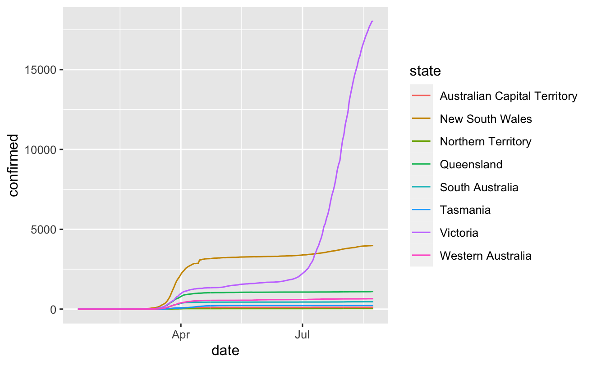

```{r setup, include=FALSE}
knitr::opts_chunk$set(echo = FALSE)
library(COVID19)
library(ggplot2)
library(dplyr)
```


```{r data,include=FALSE}
# importing data from the COVID19 database
aus19 <- covid19(country = 36, level = 2) %>%
  rename(state = administrative_area_level_2) %>%
  ungroup() %>%
  select(date, state, tests, confirmed, recovered, deaths)

today <- aus19 %>%
  filter(date == max(date))
```


# Coronavirus update for Australia - 23 August 2020

Victoria has recorded total 18029 of coronavirus since yesterday, with the total number of tests now at 2070581. 

## Cases by States 

Below is the number of cases by each state: 


Table: Today's Cases

|state                        |   tests| confirmed| deaths|
|:----------------------------|-------:|---------:|------:|
|South Australia              |  345833|       462|      4|
|Western Australia            |  301716|       651|      9|
|Queensland                   |  775546|      1103|      6|
|New South Wales              | 1969093|      3981|     52|
|Victoria                     | 2070581|     18029|    398|
|Tasmania                     |   82636|       230|     13|
|Northern Territory           |   32355|        33|      0|
|Australian Capital Territory |   69917|       113|      3|

## Historical Case Overtime 

Below is a accumulated cases by each state:



